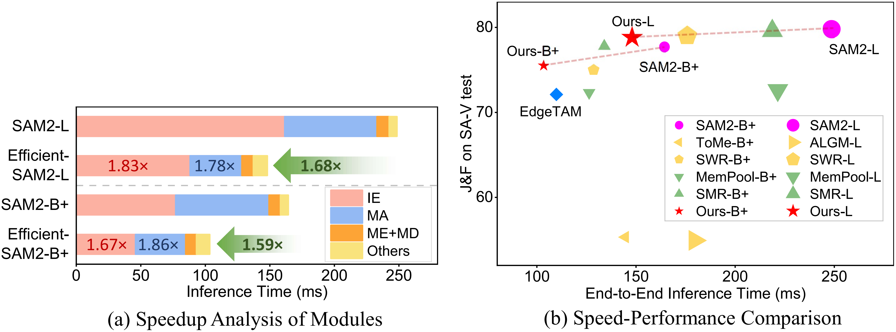

# Efficient-SAM2: Accelerating SAM2 with Object-Aware Visual Encoding and Memory Retrieval

Authors: [Jing Zhang](https://scholar.google.com/citations?hl=zh-CN&user=5PIJmvgAAAAJ), [Zhikai Li✉](https://scholar.google.com/citations?user=XwutB1AAAAAJ&hl=en), [Xuewen Liu](https://scholar.google.com/citations?user=qnklNocAAAAJ&hl=zh-CN&oi=sra), [Qingyi Gu✉](https://scholar.google.com/citations?user=qnklNocAAAAJ&hl=zh-CN&oi=sra)

(✉ denotes corresponding author.)
## Intruduction

This repository contains the official implementation for the ICLR 2026 paper "[Efficient-SAM2: Accelerating SAM2 with Object-Aware Visual Encoding and Memory Retrieval](https://openreview.net/pdf/e0892857b677265a436f5568e0a0ee1af7f956cc.pdf)".


- [Overview](#overview)
- [Create Environment](#create-environment)
- [Prepare Models](#prepare-models)
- [Usage](#usage)
    - [Train Bypass](#train-bypass)
    - [Inference](#inference)
    - [Evaluation](#evaluation)
- [Main Results](#main-results)
- [Reference](#reference)
- [Acknowledgments](#acknowledgments)


## Overview

### Motivation
SAM2's perception pattern exhibite computational redundancy. i) The focused attention in mask decoder vs. broad attention span in image encoder shows unnecessary background computation. ii) In memory bank, only a small subset of tokens contribute significantly to memory attention, and the salient regions exhibit temporal consistency.
 


### Method
For image encoder, we introduce object-aware Sparse Window Routing (SWR), which assigns object-irrelevant background windows to a lightweight shortcut branch based on spatial-temporal consistency and perceptual saliency of the object, thus reducing encoding redundancy. For memory attention, we propose object-aware Sparse Memory Retrieval (SMR), which builds a FIFO mask queue to retrieval most salient memory tokens, in which the saliency patterns are reused from their first recollection, thereby reducing the computational cost.


### Performance
Efficient-SAM2 wins a well-balanced accuracy–speed trade-off.
 


---

## Create Environment

### Prerequisites

The code requires `python>=3.10`, as well as `torch>=2.5.1` and `torchvision>=0.20.1`. Please follow the instructions [here](https://pytorch.org/get-started/locally/) to install both PyTorch and TorchVision dependencies. You can install SAM 2 on a GPU machine using:

```bash
git clone https://github.com/jingjing0419/Efficient-SAM2.git
cd sam3
pip install -e .
```
To use the SAM 2 predictor and run the example notebooks, `jupyter` and `matplotlib` are required and can be installed by:

```bash
pip install -e ".[notebooks]"
```
## Prepare Models
All the model checkpoints can be downloaded by running:

```bash
cd checkpoints && \
./download_ckpts.sh && \
cd ..
```

or individually from:

- [sam2.1_hiera_tiny.pt](https://dl.fbaipublicfiles.com/segment_anything_2/092824/sam2.1_hiera_tiny.pt)
- [sam2.1_hiera_small.pt](https://dl.fbaipublicfiles.com/segment_anything_2/092824/sam2.1_hiera_small.pt)
- [sam2.1_hiera_base_plus.pt](https://dl.fbaipublicfiles.com/segment_anything_2/092824/sam2.1_hiera_base_plus.pt)
- [sam2.1_hiera_large.pt](https://dl.fbaipublicfiles.com/segment_anything_2/092824/sam2.1_hiera_large.pt)


## Usage

### Train Bypass

```bash
python tools/train_bypass_all.py \
    --apply_bypass \
    --apply_WB \
    --use_wandb \
    --train_epoch=5 \
    --train_step=32 \
    --lr=1e-4 \
    --base_video_dir=<PATH-TO-TRAINING-IMAGES> \   
    --input_mask_dir=<PATH-TO-TRAINING-ANNOTATION> \
    --video_list_file=./train_sel_v1.txt \
    --output_mask_dir=./outputs/SAV_train/sav_train_pred_pngs \
    --dataset='sav_train' \
    --sam2_model='base+' \
    --bypass_type='bottleneck'
```


### Inference

The `vos_inference_main.py` script can be used to generate predictions for semi-supervised video object segmentation (VOS) evaluation on datasets such as [DAVIS](https://davischallenge.org/index.html), [MOSE](https://henghuiding.github.io/MOSE/) or the SA-V dataset.

After installing SAM 2 and its dependencies, it can be used as follows ([DAVIS 2017 dataset](https://davischallenge.org/davis2017/code.html) as an example). This script saves the prediction PNG files to the `--output_mask_dir`.

Run Efficient-SAM2 inference:
```bash
python tools/vos_inference_main.py \
--sam2_model='base+' --Mem_stride=1 --dataset='SAV_test' \
--apply_bypass --apply_WB --dilate_mask --WB_theta=0.7 \
--bypass_ckpt_base='./bypass/ckpt/bypass_bottleneck_base.pth' \
--prune_memory --topk_mask --set_drop_ratio=0.95 \
--output_mask_dir='./outputs2/'
```
### Evaluation
Run SA-V evaluation:
```bash
python sav_evaluator.py \
--gt_root <PATH-TO-SAV-TEST/VAL-DATASET-GROUNDTRUTH> \
--pred_root <PATH-TO-MODEL-OUTPUT>
```


<!-- ## Citations

If you use this work, please cite the original SAM 2 paper and this repository:

```bibtex
@article{ravi2024sam2,
  title={SAM 2: Segment Anything in Images and Videos},
  author={Ravi, Nikhila and Gabeur, Valentin and Hu, Yuan-Ting and others},
  journal={arXiv preprint arXiv:2408.00714},
  year={2024}
}
```

---

## License

This project is licensed under the Apache 2.0 License - see the [LICENSE](LICENSE) file for details.

## Acknowledgments

- [Meta AI Research](https://ai.meta.com/research/) for the original SAM 2 model
- [FAIR](https://research.facebook.com/blog/) for the Segment Anything project
- Contributors to the open-source computer vision community -->

---

<div align="center">

**Star this repository if you find it helpful!**

</div>
